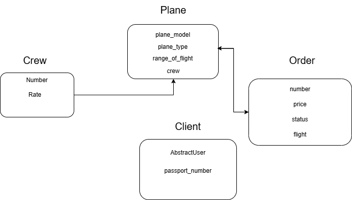
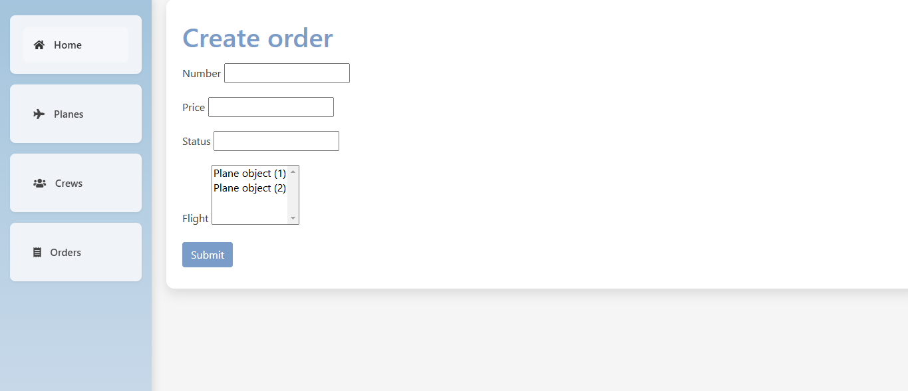
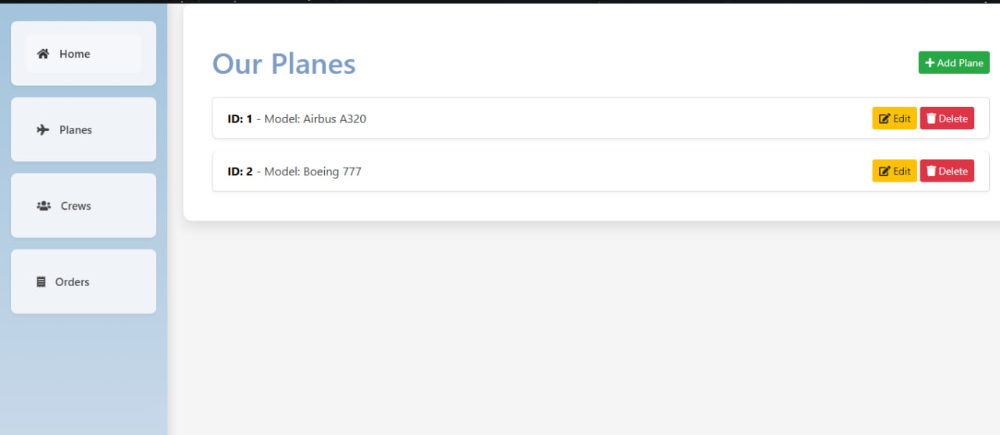
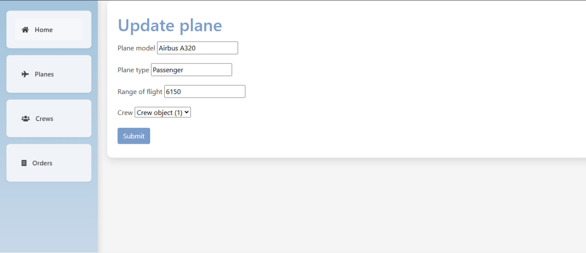
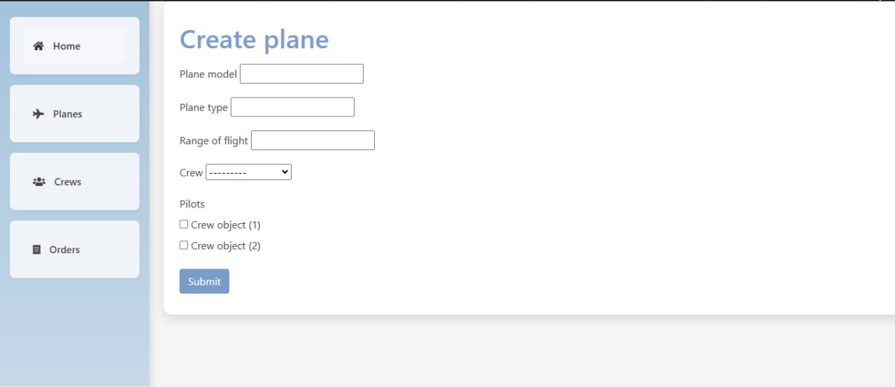
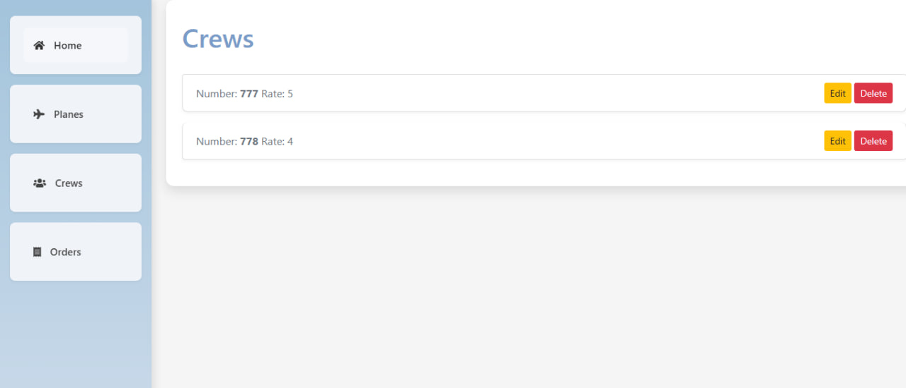
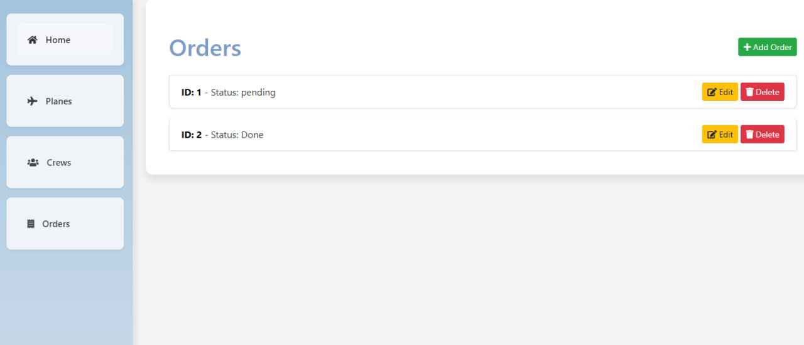

# Airplane Management System

## Project Overview
The **Airplane Management System** is designed to manage airplanes, their crews, and flight orders. It provides a streamlined way to track key entities such as planes, crew members, clients, and orders.

---

## Entity-Relationship Diagram


### Entities and Relationships:
- **Plane:**
  - Attributes: `plane_model`, `plane_type`, `range_of_flight`, `crew`
- **Crew:**
  - Attributes: `number`, `rate`
- **Order:**
  - Attributes: `number`, `price`, `status`, `flight`
- **Client:**
  - Attributes: `AbstractUser`, `passport_number`

---
## Main page


## Planes list


## Update plane


## Create plane


## Crews list


## Orders list


## Create order


## Key Features
- Management of airplane details including model, type, and range.
- Crew member tracking with rating and identification.
- Flight order processing with pricing and status tracking.
- Integration of clients with secure identification based on passport numbers.

---

## Installation
1. Clone the repository:
   ```bash
   git clone https://github.com/your-repo/airplane-management-system.git
   ```
2. Navigate to the project directory:
   ```bash
   cd airplane-management-system
   ```
3. Install the dependencies:
   ```bash
   pip install -r requirements.txt
   ```
4. Apply database migrations:
   ```bash
   python manage.py migrate
   ```
5. Start the development server:
   ```bash
   python manage.py runserver
   ```

---

## Usage
1. Access the system at [http://localhost:8000](http://localhost:8000).
2. Manage planes, crew, and orders via the dashboard.
3. View and modify client information as needed.

---

## Project Structure
```
project_root/
├── manage.py
├── app/
│   ├── models.py
│   ├── views.py
│   └── templates/
├── requirements.txt
└── README.md
```

---

## Contributors
- **Dmytro Prokhach**  
  *Project Administrator*

---

## License
This project is licensed under the MIT License. See the [LICENSE](LICENSE) file for details.

---

## Future Enhancements
- Adding authentication and user role management.
- Enhancing UI/UX for better usability.
- Integration with external flight APIs.

